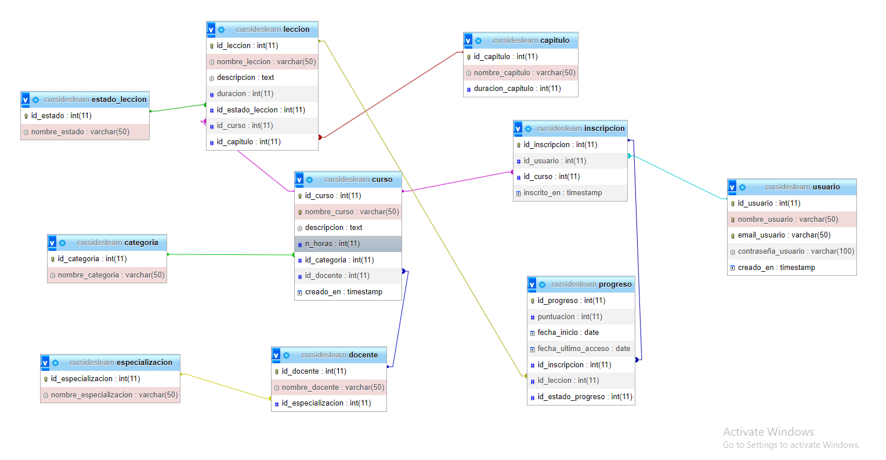

## Cursides School

### Proyecto de cursos en linea:
Este proyecto constara con las siguientes tablas: 
- ``capitulo``
- ``categoria``
- ``curso``
- ``docente``
- ``especializacion``
- ``estado_leccion``
- ``inscripcion``
- ``leccion``
- ``progreso``
- ``usuario``

## Objetivo general
Brindar al internauta un contenido de apoyo y de calidad sobre desarrollo web, donde el consumidor pueda incrementar sus habilidades en el entorno de la programación y sus diferentes tecnologias. Tendra acceso a cursos, lecciones, categorias, comentarios, lo que que hace que la navegación tenga mas interactividad.

## Objetivos especificos
- Endpoint donde el usuario pueda ingresar a su cuenta y crear una sesión.
- Endpoint para el registro de usuarios
- Endpoint donde el usuario consulte la informacion de los cursos donde se ha inscrito
- Inscripciones para cada curso
- Mostrar los capítulos de un curso y el número de lecciones en cada capítulo
- Mostrar la cantidad de usuarios inscritos en cada categoría de cursos.
- Listar los docentes y su cantidad de especializaciones.
- Obtener el progreso de un usuario en un curso (El estado de las lecciones)

## Tecnologias a utilizar 
- ``Node.js``
- ``Javascript``
- ``Typescript``
- ``sql``
- ``Express.js``	

## Diagrama 
